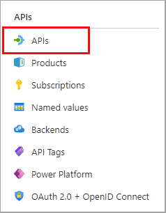

---
lab:
  topic: Azure API Management
  title: 使用 Azure API 管理匯入和設定 API
  description: 了解如何匯出、發佈和測試符合 OpenAPI 規格的 API。
---

# 使用 Azure API 管理匯入和設定 API

在本練習中，您將建立 Azure API 管理執行個體、匯入 OpenAPI 規格後端 API、設定 API 設定 (包括 Web 服務 URL 和訂閱需求)，以及測試 API 作業以確認其正常運作。

在此練習中執行的工作：

* 建立 Azure API 管理 (APIM) 執行個體
* 匯入 API
* 設定後端設定
* 測試 API

本練習大約需要 **20** 分鐘才能完成。

## 建立 API 管理執行個體

在本練習的此章節中，您將建立資源群組和 Azure 儲存體帳戶。 您也可以記錄帳戶的端點和存取金鑰。

1. 在網頁瀏覽器中，瀏覽至 Azure 入口網站 [https://portal.azure.com](https://portal.azure.com)；若出現提示，請使用您的 Azure 認證登入。

1. 使用頁面上方搜尋欄右側的 **[\>_]** 按鈕，就能從 Azure 入口網站建立新的 Cloud Shell，並選取 ***Bash*** 環境。 Cloud Shell 會在 Azure 入口網站底部的窗格顯示命令列介面。 如果系統提示您選取儲存體帳戶以保存檔案，請選取 [不需要儲存體帳戶]****、[您的訂用帳戶]，然後選取 [套用]****。

    > **備註**：如果您之前就已建立使用 *Bash* 環境的 Cloud Shell，請將原先的設定切換成 ***PowerShell***。

1. 針對本練習所需的資源建立資源群組。 將 **myResourceGroup** 取代為您想要用於資源群組的名稱。 如有必要，您可以使用附近的地區來取代 **eastus2**。 如果您已有想要使用的資源群組，請繼續進行下一個步驟。

    ```azurecli
    az group create --location eastus2 --name myResourceGroup
    ```

1. 建立一些變數供 CLI 命令使用，這樣可以減少輸入次數。 將 **myLocation** 取代為您先前選擇的值。 APIM 名稱必須是全域唯一的名稱，而下列指令碼會產生隨機字串。 將 **myEmail** 取代為您可以使用的電子郵件地址。

    ```bash
    myApiName=import-apim-$RANDOM
    myLocation=myLocation
    myEmail=myEmail
    ```

1. 建立 APIM 執行個體。 **az apim create** 命令可用來建立執行個體。 將 **myResourceGroup** 取代為先前選擇的值。

    ```bash
    az apim create -n $myApiName \
        --location $myLocation \
        --publisher-email $myEmail  \
        --resource-group myResourceGroup \
        --publisher-name Import-API-Exercise \
        --sku-name Consumption 
    ```
    > **注意：** 此作業應該會在約五分鐘內完成。 

## 匯入後端 API

本節示範如何匯入和發佈 OpenAPI 規格後端 API。

1. 在 Azure 入口網站中，搜尋並選取 **API 管理服務**。

1. 在 [API 管理服務]**** 畫面中，選取您建立的 API 管理執行個體。

1. 在 [API 管理服務]**** 瀏覽窗格中，選取 [> API]****，然後選取 [API]****。

    


1. 在 [從定義建立] **** 區段中選取 [OpenAPI]****，然後在出現的快顯視窗中將 [基本/完整]**** 切換為 [完整]****。

    

    使用下表中的值來填寫表單。 任何未提及的欄位可保留預設值。

    | 設定 | 值 | Description |
    |--|--|--|
    | **OpenAPI 規格** | `https://bigconference.azurewebsites.net/` | 參考實作 API 的服務，要求會轉送到此位址。 在輸入此值之後，表單中大部分的必要資訊都會自動填入。 |
    | **URL 配置** | 選取 [HTTPS]****。 | 定義 API 接受的 HTTP 通訊協定安全性層級。 |

1. 選取 **建立**。

## 設定 API 設定

*大型會議 API* 已建立。 現在您可以設定 API 設定。 

1. 選擇功能表中的 [設定]****。

1. 在 [Web 服務 URL]**** 欄位中輸入 `https://bigconference.azurewebsites.net/`。

1. 取消選取 [需要訂閱]**** 核取方塊。

1. 選取**儲存**。

## 測試 API

現在 API 已匯入並設定好，您可以測試 API。

1. 在功能表列中，選取 [測試]****。 這會顯示 API 中所有可用的作業。

1. 搜尋並選取 **Speakers_Get** 作業。 

1. 請選取**傳送**。 您可能需要在頁面上向下捲動才能檢視 HTTP 回應。

    後端會回應 **200 OK** 與部分資料。

## 清除資源

現在您已完成練習，您應該刪除建立的雲端資源，以避免不必要的資源使用狀況。

1. 在網頁瀏覽器中，瀏覽至 Azure 入口網站 [https://portal.azure.com](https://portal.azure.com)；若出現提示，請使用您的 Azure 認證登入。
1. 瀏覽至您建立的資源群組，並檢視此練習中所使用的資源內容。
1. 在工具列上，選取 [刪除資源群組]****。
1. 輸入資源群組名稱並確認您想要將其刪除。

> **注意：** 刪除資源群組時，會刪除其中包含的所有資源。 如果您選擇此練習的現有資源群組，則本練習範圍外的任何現有資源也將遭到刪除。
