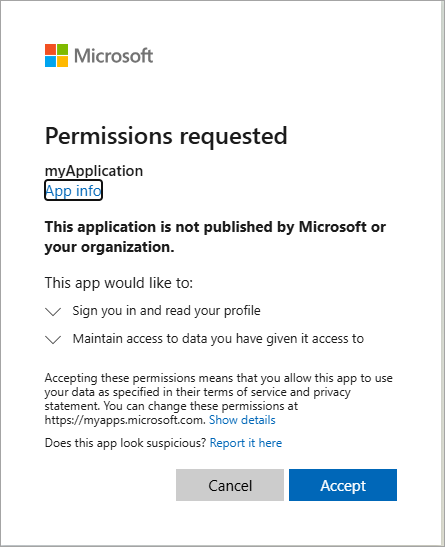

---
lab:
  topic: Azure authentication and authorization
  title: 使用 MSAL.NET 實作互動式驗證
  description: 了解如何使用 MSAL.NET SDK 實作互動式驗證並取得權杖。
---

# 使用 MSAL.NET 實作互動式驗證

在本練習中，您將在 Microsoft Entra ID 中註冊應用程式，然後建立 .NET 主控台應用程式，以使用 MSAL.NET 來執行互動式驗證，並取得 Microsoft Graph 的存取權杖。 您將了解如何設定驗證範圍、處理使用者同意，以及查看如何快取權杖以供後續執行。 

在此練習中執行的工作：

* 使用 Microsoft 身分識別平台來註冊應用程式
* 建立實作 **PublicClientApplicationBuilder** 類別的 .NET 主控台應用程式，以設定驗證。
* 使用 **user.read** Microsoft Graph 權限，以互動方式取得權杖。

本練習大約需要 **15** 分鐘才能完成。

## 在您開始使用 Intune 之前

若要完成此練習，您需要：

* Azure 訂用帳戶。 如果您沒有免費試用版，則可以[免費註冊](https://azure.microsoft.com/)。

* 其中一個[支援平台](https://code.visualstudio.com/docs/supporting/requirements#_platforms)上的 [Visual Studio Code](https://code.visualstudio.com/)。

* [.NET 8](https://dotnet.microsoft.com/en-us/download/dotnet/8.0) 或更新版本。

* 適用於 Visual Studio Code 的 [C# 開發套件](https://marketplace.visualstudio.com/items?itemName=ms-dotnettools.csdevkit)。

## 註冊新的應用程式

1. 在網頁瀏覽器中，瀏覽至 Azure 入口網站 [https://portal.azure.com](https://portal.azure.com)；若出現提示，請使用您的 Azure 認證登入。

1. 在入口網站中，搜尋並選取 [應用程式註冊]****。 

1. [註冊應用程式]**** 頁面出現後，選取 [+ 新註冊]****，並輸入應用程式的註冊資訊：

    | 欄位 | 值 |
    |--|--|
    | **名稱** | 輸入 `myMsalApplication`  |
    | **支援的帳戶類型** | 選取 [僅此組織目錄中的帳戶]**** |
    | **重新導向 URI (選用)** | 選取 [公用用戶端/原生 (行動裝置與電腦)]****，然後在右側方塊中輸入 `http://localhost`。 |

1. 選取**註冊**。 Microsoft Entra ID 會將唯一應用程式 (用戶端) 識別碼指派給您的應用程式，然後系統會帶您進入應用程式的 [概觀]**** 頁面。 

1. 在 [概觀]**** 頁面的 [基本功能]**** 區段中，記錄 [應用程式 (用戶端) 識別碼]**** 和 [目錄 (租用戶) 識別碼]****。 應用程式需要此資訊。

    
 
## 建立 .NET 主控台應用程式以取得權杖

現在所需的資源已部署至 Azure，下一個步驟是設定主控台應用程式。 下列步驟會在您的本機環境中執行。

1. 為專案建立名為 **authapp** 的資料夾，或您自行選擇的名稱。

1. 啟動 **Visual Studio Code**，選取 [檔案] > [開啟資料夾...]****，然後選取專案資料夾。

1. 選取 [檢視] > [終端機]**** 以開啟終端機。

1. 在 VS Code 終端機中執行下列命令，以建立 .NET 主控台應用程式。

    ```
    dotnet new console
    ```

1. 執行下列命令，將 **Microsoft.Identity.Client** 和 **dotenv.net** 套件新增至專案。

    ```
    dotnet add package Microsoft.Identity.Client
    dotnet add package dotenv.net
    ```

### 設定主控台應用程式

在本章節中，您將建立和編輯 **.env** 檔案，以保存先前錄製的秘密。 

1. 選取 [檔案] > [新增檔案...]****，然後在專案資料夾中建立名為 *.env* 的檔案。

1. 開啟 **.env** 檔案並新增下列程式碼。 將 **YOUR_CLIENT_ID** 和 **YOUR_TENANT_ID** 取代為您先前記錄的值。

    ```
    CLIENT_ID="YOUR_CLIENT_ID"
    TENANT_ID="YOUR_TENANT_ID"
    ```

1. 按 **ctrl+s** 以儲存變更。

### 新增專案的起始程式碼

1. 開啟 *Program.cs* 檔案，並以下列程式碼取代現有內容。 請務必檢閱程式碼中的註解。

    ```csharp
    using Microsoft.Identity.Client;
    using dotenv.net;
    
    // Load environment variables from .env file
    DotEnv.Load();
    var envVars = DotEnv.Read();
    
    // Retrieve Azure AD Application ID and tenant ID from environment variables
    string _clientId = envVars["CLIENT_ID"];
    string _tenantId = envVars["TENANT_ID"];
    
    // ADD CODE TO DEFINE SCOPES AND CREATE CLIENT 
    
    
    
    // ADD CODE TO ACQUIRE AN ACCESS TOKEN
    
    
    ```

1. 按 **ctrl+s** 以儲存變更。

### 新增程式碼以完成應用程式

1. 找到 **// ADD CODE TO DEFINE SCOPES AND CREATE CLIENT** 註解，並在註解之後直接新增下列程式碼。 請務必檢閱程式碼中的註解。

    ```csharp
    // Define the scopes required for authentication
    string[] _scopes = { "User.Read" };
    
    // Build the MSAL public client application with authority and redirect URI
    var app = PublicClientApplicationBuilder.Create(_clientId)
        .WithAuthority(AzureCloudInstance.AzurePublic, _tenantId)
        .WithDefaultRedirectUri()
        .Build();
    ```

1. 找到 **// ADD CODE TO ACQUIRE AN ACCESS TOKEN** 註解，並在註解之後直接新增下列程式碼。 請務必檢閱程式碼中的註解。

    ```csharp
    // Attempt to acquire an access token silently or interactively
    AuthenticationResult result;
    try
    {
        // Try to acquire token silently from cache for the first available account
        var accounts = await app.GetAccountsAsync();
        result = await app.AcquireTokenSilent(_scopes, accounts.FirstOrDefault())
                    .ExecuteAsync();
    }
    catch (MsalUiRequiredException)
    {
        // If silent token acquisition fails, prompt the user interactively
        result = await app.AcquireTokenInteractive(_scopes)
                    .ExecuteAsync();
    }
    
    // Output the acquired access token to the console
    Console.WriteLine($"Access Token:\n{result.AccessToken}");
    ```

1. 按 **ctrl+s** 以儲存檔案，然後按 **ctrl+q** 以結束編輯器。

## 執行應用程式

現在應用程式已完成，接下來請執行。 

1. 執行下列命令以啟動應用程式：

    ```
    dotnet run
    ```

1. 應用程式會開啟預設瀏覽器，提示您選取想要用來驗證的帳戶。 如果列出多個帳戶，請選取與應用程式中所使用租用戶相關聯的帳戶。

1. 如果這是您第一次向已註冊的應用程式進行驗證，您會收到**要求的權限**通知，要求您核准應用程式將您登入、讀取您的個人資料，並維護您授與的資料存取權。 選取 [接受]****。

    

1. 您應該會在主控台中看到類似下列範例的結果。

    ```
    Access Token:
    eyJ0eXAiOiJKV1QiLCJub25jZSI6IlZF.........
    ```

1. 再次啟動應用程式之後，您會注意到您不再收到**要求的權限**通知。 已快取您先前授與的權限。

## 清除資源

現在您已完成練習，您應該刪除先前建立的應用程式註冊。

1. 在 Azure 入口網站中，瀏覽至您建立的應用程式註冊。
1. 在工具列上，選取 [刪除]****。
1. 確認刪除。
