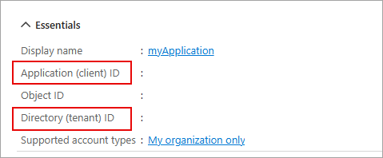

---
lab:
  topic: Azure authentication and authorization
  title: 使用 Microsoft Graph SDK 擷取使用者設定檔資訊
  description: 了解如何從 Microsoft Graph 擷取使用者設定檔資訊。
---

# 使用 Microsoft Graph SDK 擷取使用者設定檔資訊

在本練習中，您將建立 .NET 應用程式以使用 Microsoft Entra ID 進行驗證，並要求存取權杖，然後呼叫 Microsoft Graph API 來擷取並顯示您的使用者設定檔資訊。 您將了解如何從應用程式設定權限權並與 Microsoft Graph 互動。

在此練習中執行的工作：

* 使用 Microsoft 身分識別平台來註冊應用程式
* 建立實作互動式驗證的 .NET 主控台應用程式，並使用 **GraphServiceClient** 類別來擷取使用者設定檔資訊。

本練習大約需要 **15** 分鐘才能完成。

## 在您開始使用 Intune 之前

若要完成此練習，您需要：

* Azure 訂用帳戶。 如果您沒有免費試用版，則可以[免費註冊](https://azure.microsoft.com/)。

* 其中一個[支援平台](https://code.visualstudio.com/docs/supporting/requirements#_platforms)上的 [Visual Studio Code](https://code.visualstudio.com/)。

* [.NET 8](https://dotnet.microsoft.com/en-us/download/dotnet/8.0) 或更新版本。

* 適用於 Visual Studio Code 的 [C# 開發套件](https://marketplace.visualstudio.com/items?itemName=ms-dotnettools.csdevkit)。

## 註冊新的應用程式

1. 在網頁瀏覽器中，瀏覽至 Azure 入口網站 [https://portal.azure.com](https://portal.azure.com)；若出現提示，請使用您的 Azure 認證登入。

1. 在入口網站中，搜尋並選取 [應用程式註冊]****。 

1. [註冊應用程式]**** 頁面出現後，選取 [+ 新註冊]****，並輸入應用程式的註冊資訊：

    | 欄位 | 值 |
    |--|--|
    | **名稱** | 輸入 `myGraphApplication`  |
    | **支援的帳戶類型** | 選取 [僅此組織目錄中的帳戶]**** |
    | **重新導向 URI (選用)** | 選取 [公用用戶端/原生 (行動裝置與電腦)]****，然後在右側方塊中輸入 `http://localhost`。 |

1. 選取**註冊**。 Microsoft Entra ID 會將唯一應用程式 (用戶端) 識別碼指派給您的應用程式，然後系統會帶您進入應用程式的 [概觀]**** 頁面。 

1. 在 [概觀]**** 頁面的 [基本功能]**** 區段中，記錄 [應用程式 (用戶端) 識別碼]**** 和 [目錄 (租用戶) 識別碼]****。 應用程式需要此資訊。

    
 
## 建立 .NET 主控台應用程式以傳送和接收訊息

現在所需的資源已部署至 Azure，下一個步驟是設定主控台應用程式。 下列步驟會在您的本機環境中執行。

1. 為專案建立名為 **graphapp** 的資料夾，或您自行選擇的名稱。

1. 啟動 **Visual Studio Code**，選取 [檔案] > [開啟資料夾...]****，然後選取專案資料夾。

1. 選取 [檢視] > [終端機]**** 以開啟終端機。

1. 在 VS Code 終端機中執行下列命令，以建立 .NET 主控台應用程式。

    ```
    dotnet new console
    ```

1. 執行下列命令，將 **Azure.Identity**、**Microsoft.Graph** 和 **dotenv.net** 套件新增至專案。

    ```
    dotnet add package Azure.Identity
    dotnet add package Microsoft.Graph
    dotnet add package dotenv.net
    ```

### 設定主控台應用程式

在本章節中，您將建立和編輯 **.env** 檔案，以保存先前錄製的秘密。 

1. 選取 [檔案] > [新增檔案...]****，然後在專案資料夾中建立名為 *.env* 的檔案。

1. 開啟 **.env** 檔案並新增下列程式碼。 將 **YOUR_CLIENT_ID** 和 **YOUR_TENANT_ID** 取代為您先前記錄的值。

    ```
    CLIENT_ID="YOUR_CLIENT_ID"
    TENANT_ID="YOUR_TENANT_ID"
    ```

1. 按 **ctrl+s** 以儲存檔案。

### 新增專案的起始程式碼

1. 開啟 *Program.cs* 檔案，並以下列程式碼取代現有內容。 請務必檢閱程式碼中的註解。

    ```csharp
    using Microsoft.Graph;
    using Azure.Identity;
    using dotenv.net;
    
    // Load environment variables from .env file (if present)
    DotEnv.Load();
    var envVars = DotEnv.Read();
    
    // Read Azure AD app registration values from environment
    string clientId = envVars["CLIENT_ID"];
    string tenantId = envVars["TENANT_ID"];
    
    // Validate that required environment variables are set
    if (string.IsNullOrEmpty(clientId) || string.IsNullOrEmpty(tenantId))
    {
        Console.WriteLine("Please set CLIENT_ID and TENANT_ID environment variables.");
        return;
    }
    
    // ADD CODE TO DEFINE SCOPE AND CONFIGURE AUTHENTICATION
    
    
    
    // ADD CODE TO CREATE GRAPH CLIENT AND RETRIEVE USER PROFILE
    
    
    ```

1. 按 **ctrl+s** 以儲存變更。

### 新增程式碼以完成應用程式

1. 找到 **// ADD CODE TO DEFINE SCOPE AND CONFIGURE AUTHENTICATION** 註解，並在註解之後直接新增下列程式碼。 請務必檢閱程式碼中的註解。

    ```csharp
    // Define the Microsoft Graph permission scopes required by this app
    var scopes = new[] { "User.Read" };
    
    // Configure interactive browser authentication for the user
    var options = new InteractiveBrowserCredentialOptions
    {
        ClientId = clientId, // Azure AD app client ID
        TenantId = tenantId, // Azure AD tenant ID
        RedirectUri = new Uri("http://localhost") // Redirect URI for auth flow
    };
    var credential = new InteractiveBrowserCredential(options);
    ```

1. 找到 **// ADD CODE TO CREATE GRAPH CLIENT AND RETRIEVE USER PROFILE** 註解，並在註解之後直接新增下列程式碼。 請務必檢閱程式碼中的註解。

    ```csharp
    // Create a Microsoft Graph client using the credential
    var graphClient = new GraphServiceClient(credential);
    
    // Retrieve and display the user's profile information
    Console.WriteLine("Retrieving user profile...");
    await GetUserProfile(graphClient);
    
    // Function to get and print the signed-in user's profile
    async Task GetUserProfile(GraphServiceClient graphClient)
    {
        try
        {
            // Call Microsoft Graph /me endpoint to get user info
            var me = await graphClient.Me.GetAsync();
            Console.WriteLine($"Display Name: {me?.DisplayName}");
            Console.WriteLine($"Principal Name: {me?.UserPrincipalName}");
            Console.WriteLine($"User Id: {me?.Id}");
        }
        catch (Exception ex)
        {
            // Print any errors encountered during the call
            Console.WriteLine($"Error retrieving profile: {ex.Message}");
        }
    }
    ```

1. 按 **ctrl+s** 以儲存檔案。

## 執行應用程式

現在應用程式已完成，接下來請執行。 

1. 執行下列命令以啟動應用程式：

    ```
    dotnet run
    ```

1. 應用程式會開啟預設瀏覽器，提示您選取想要用來驗證的帳戶。 如果列出多個帳戶，請選取與應用程式中所使用租用戶相關聯的帳戶。

1. 如果這是您第一次向已註冊的應用程式進行驗證，您會收到**要求的權限**通知，要求您核准應用程式將您登入、讀取您的個人資料，並維護您授與的資料存取權。 選取 [接受]****。

    

1. 您應該會在主控台中看到類似下列範例的結果。

    ```
    Retrieving user profile...
    Display Name: <Your account display name>
    Principal Name: <Your principal name>
    User Id: 9f5...
    ```

1. 再次啟動應用程式之後，您會注意到您不再收到**要求的權限**通知。 已快取您先前授與的權限。

## 清除資源

現在您已完成練習，您應該刪除建立的雲端資源，以避免不必要的資源使用狀況。

1. 在網頁瀏覽器中，瀏覽至 Azure 入口網站 [https://portal.azure.com](https://portal.azure.com)；若出現提示，請使用您的 Azure 認證登入。
1. 瀏覽至您建立的資源群組，並檢視此練習中所使用的資源內容。
1. 在工具列上，選取 [刪除資源群組]****。
1. 輸入資源群組名稱並確認您想要將其刪除。

> **注意：** 刪除資源群組時，會刪除其中包含的所有資源。 如果您選擇此練習的現有資源群組，則本練習範圍外的任何現有資源也將遭到刪除。
