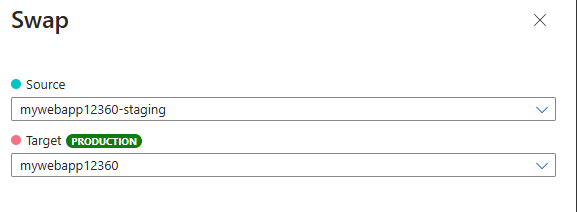

---
lab:
  topic: Azure App Service
  title: 在 Azure App Service 中交換部署位置
  description: 了解如何在 Azure App Service 中交換部署位置。 在本練習中，您將部署簡單的應用程式至 App Service、對應用程式進行些微變更並部署至預備位置，最後將交換位置，讓更新的應用程式進入生產環境。
---

# 在 Azure App Service 中交換部署位置

在本練習中，您將部署靜態 HTML 網站至 Azure App Service、建立預備部署位置、變更程式碼，接著將程式碼部署至預備位置，然後交換預備與生產位置，使變更進入生產環境。 您將了解如何使用部署位置進行安全的應用程式更新和藍綠部署。

在此練習中執行的工作：

* 下載並部署範例應用程式至 Azure App Service。
* 建立預備部署位置。
* 變更範例應用程式，並部署到預備位置。
* 交換預備和預設生產位置，將變更移至生產位置。

本練習大約需要 **30** 分鐘才能完成。

## 下載並部署範例應用程式

在本章節中，您將下載範例應用程式並設定變數，讓命令更容易輸入，然後使用 Azure CLI 命令建立 Azure App Service 資源並部署靜態 HTML 網站。

1. 在網頁瀏覽器中，瀏覽至 Azure 入口網站 [https://portal.azure.com](https://portal.azure.com)；若出現提示，請使用您的 Azure 認證登入。

1. 使用頁面上方搜尋欄右側的 **[\>_]** 按鈕，就能從 Azure 入口網站建立新的 Cloud Shell，並選取 ***Bash*** 環境。 Cloud Shell 會在 Azure 入口網站底部的窗格顯示命令列介面。 如果系統提示您選取儲存體帳戶以保存檔案，請選取 [不需要儲存體帳戶]****、[您的訂用帳戶]，然後選取 [套用]****。

    > **備註**：如果您之前就已建立使用 *Bash* 環境的 Cloud Shell，請將原先的設定切換成 ***PowerShell***。

1. 在 Cloud Shell 工具列中，在**設定**功能表中，選擇**轉到經典版本**（這是使用程式碼編輯器所必需的）。

1. 執行下列 **git** 命令來複製範例應用程式存放庫。

    ```bash
    git clone https://github.com/Azure-Samples/html-docs-hello-world.git
    ```

1. 執行下列命令，以設定變數來保留資源群組和應用程式名稱。 如果您有要使用的資源群組，您可以取代 **resourceGroup** 的 **rg-mywebapp** 值。 記下命令執行之後顯示的 **appName** 值，該值將在稍後於本練習中使用。

    ```bash
    resourceGroup=rg-mywebapp

    appName=mywebapp$RANDOM
    echo $appName
    ```

1. 瀏覽至包含範例程式碼的目錄，並執行 **az webapp up** 命令。 **注意：** 執行此命令可能需要幾分鐘的時間。

    ```bash
    cd html-docs-hello-world

    az webapp up -g $resourceGroup -n $appName --sku P0V3 --html
    ```

    現在您的部署已完成，接下來請檢視 Web 應用程式。

1. 在 Azure 入口網站中，瀏覽至您部署的 Web 應用程式。 您可以在 [搜尋資源、服務和文件 (G + /)]**** 搜尋列中輸入您先前記下的名稱，然後從清單中選取資源。

1. 在 [基本功能] **** 區段中，選取 [預設網域]**** 欄位中的 Web 應用程式連結。 該連結會在新索引標籤中開啟網站。

## 將更新程式碼部署至部署位置

在本章節中，您將建立部署位置、修改應用程式中的 HTML，以及將更新程式碼部署至新的部署位置。

### 建立部署位置 

1. 返回 Azure 入口網站和 Cloud Shell 的索引標籤。

1. 在 Cloud Shell 中輸入下列命令，以建立名為 *staging* 的部署位置。

    ```bash
    az webapp deployment slot create -n $appName -g $resourceGroup --slot staging
    ```

1. 等候命令完成，然後在左側功能表中選取 [部署] > [部署位置]****，以檢視 Web 應用程式的部署位置。 請注意，新位置的名稱包含附加至 Web 應用程式名稱的 *-staging*

### 更新程式碼並部署到預備位置

1. 在 Cloud Shell 中，輸入 **index.html** 以開啟編輯器。 找到 **\<h1\>** 標題標籤，將 [Azure App Service - 範例靜態 HTML 網站]** 變更為 [Azure App Service 預備位置]**，或變更為您想要的任何其他內容。

1. 使用 **ctrl-s** 命令來儲存，並使用 **ctrl-q** 來結束。

1. 在 Cloud Shell 中執行下列命令，以建立已更新專案的 ZIP 檔案。 下一個步驟需要 zip 或 Web 應用程式資源 (WAR) 檔案。

    ```bash
    zip -r stagingcode.zip .
    ```

1. 在 Cloud Shell 中執行下列命令，將更新部署至預備位置。

    ```bash
    az webapp deploy -g $resourceGroup -n $appName --src-path ./stagingcode.zip --slot staging
    ```

1. 在 Web 應用程式的左側功能表中，選取 [部署] > [部署位置]****，然後選取您先前建立的預備位置。

1. 在 [基本功能]**** 區段中，選取 [預設網域]**** 欄位中的連結。 該連結會在新索引標籤中開啟預備位置的網站。

## 交換預備與生產位置

您可以使用工具列中的 [交換]**** 選項，在 Azure 入口網站中執行交換。 如果您在 Web 應用程式左側功能表中選取 [概觀]**** 或 [部署] > [部署位置]****，則工具列中會出現 [交換]**** 選項。

1. 在 Azure 入口網站中，選取工具列中的 [交換]**** 以開啟 [交換]**** 面板。

1. 在交換面板中檢閱設定。 **來源**應顯示 **-staging** 位置，而**目標**應顯示預設生產位置。

    

1. 選取 [開始交換]****，並等候作業完成。 您可以選取入口網站頂端的鈴鐺圖示以開啟**通知**面板，追蹤完成情況。

1. 若要確認交換，請瀏覽至您部署的 Web 應用程式。 在 [搜尋資源、服務和文件 (G + /)]**** 搜尋列中輸入您先前建立的 Web 應用程式名稱 (例如，*mywebapp12360*)，然後從清單中選取資源。

1. 在 [基本功能] **** 區段中，選取 [預設網域]**** 欄位中的 Web 應用程式連結。 該連結會在新索引標籤中開啟網站 (生產位置)。

1. 確認您的變更。您可能需要重新更新頁面，變更才會出現。

## 清除資源

現在您已完成練習，您應該刪除建立的雲端資源，以避免不必要的資源使用狀況。

1. 在網頁瀏覽器中，瀏覽至 Azure 入口網站 [https://portal.azure.com](https://portal.azure.com)；若出現提示，請使用您的 Azure 認證登入。
1. 瀏覽至您建立的資源群組，並檢視此練習中所使用的資源內容。
1. 在工具列上，選取 [刪除資源群組]****。
1. 輸入資源群組名稱並確認您想要將其刪除。

> **注意：** 刪除資源群組時，會刪除其中包含的所有資源。 如果您選擇此練習的現有資源群組，則本練習範圍外的任何現有資源也將遭到刪除。
