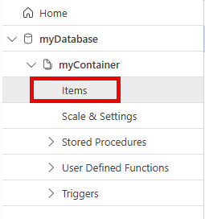

---
lab:
  topic: Azure Cosmos DB
  title: 使用 .NET 在 Azure Cosmos DB for NoSQL 中建立資源
  description: 了解如何在 Azure Cosmos DB 中使用 Microsoft .NET SDK v3 建立資料庫和容器資源。
---

# 使用 .NET 在 Azure Cosmos DB for NoSQL 中建立資源

在本練習中，您將建立 Azure Cosmos DB 帳戶，並建置使用 Microsoft Azure Cosmos DB SDK 建立資料庫、容器和範例項目的 .NET 主控台應用程式。 您將了解如何設定驗證、以程式設計方式執行資料庫作業，以及在 Azure 入口網站中驗證結果。

在此練習中執行的工作：

* 建立 Azure Cosmos DB 帳戶
* 建立可建立資料庫、容器和項目的主控台應用程式
* 執行主控台應用程式並驗證結果

本練習大約需要 **30** 分鐘才能完成。

## 建立 Azure Cosmos DB 帳戶

在本練習的此章節中，您將建立資源群組和 Azure Cosmos DB 帳戶。 您也可以記錄帳戶的端點和存取金鑰。

1. 在網頁瀏覽器中，瀏覽至 Azure 入口網站 [https://portal.azure.com](https://portal.azure.com)；若出現提示，請使用您的 Azure 認證登入。

1. 使用頁面上方搜尋欄右側的 **[\>_]** 按鈕，就能從 Azure 入口網站建立新的 Cloud Shell，並選取 ***Bash*** 環境。 Cloud Shell 會在 Azure 入口網站底部的窗格顯示命令列介面。 如果系統提示您選取儲存體帳戶以保存檔案，請選取 [不需要儲存體帳戶]****、[您的訂用帳戶]，然後選取 [套用]****。

    > **備註**：如果您之前就已建立使用 *Bash* 環境的 Cloud Shell，請將原先的設定切換成 ***PowerShell***。

1. 在 Cloud Shell 工具列中，在**設定**功能表中，選擇**轉到經典版本**（這是使用程式碼編輯器所必需的）。

1. 針對本練習所需的資源建立資源群組。 如果您已有想要使用的資源群組，請繼續進行下一個步驟。 將 **myResourceGroup** 取代為您想要用於資源群組的名稱。 如有必要，您可以使用附近的地區來取代 **eastus**。

    ```
    az group create --location eastus --name myResourceGroup
    ```

1. 許多命令需要唯一名稱，並使用相同的參數。 建立一些變數將減少建立資源的命令所需的變更。 執行下列命令來建立所需的變數。 將 **myResourceGroup** 取代為您用於此練習的名稱。

    ```
    resourceGroup=myResourceGroup
    accountName=cosmosexercise$RANDOM
    ```

1. 執行下列命令以建立 Azure Cosmos DB 帳戶，每個帳戶名稱都必須是獨一無二的。 

    ```
    az cosmosdb create --name $accountName \
        --resource-group $resourceGroup
    ```

1.  執行下列命令，以擷取 Azure Cosmos DB 帳戶的 **documentEndpoint**。 從命令結果記錄端點，該端點將在稍後於本練習中使用。

    ```
    az cosmosdb show --name $accountName \
        --resource-group $resourceGroup \
        --query "documentEndpoint" --output tsv
    ```

1. 使用下列命令擷取帳戶的主索引鍵。 從命令結果記錄主索引鍵，該端點將在稍後於本練習中使用。

    ```
    az cosmosdb keys list --name $accountName \
        --resource-group $resourceGroup \
        --query "primaryMasterKey" --output tsv
    ```

## 使用 .NET 主控台應用程式建立資料資源和項目

現在所需的資源已部署至 Azure，下一個步驟是設定主控台應用程式。 下列步驟是在 Cloud Shell 中執行。

>**提示：** 拖曳頂端框線調整 Cloud Shell 的大小，以顯示更多資訊和程式碼。 您也可以使用最小化和最大化按鈕，在 Cloud Shell 和主要入口網站介面之間切換。

1. 建立專案的資料夾並進行變更。

    ```bash
    mkdir cosmosdb
    cd cosmosdb
    ```

1. 建立 .NET 主控台應用程式。

    ```bash
    dotnet new console
    ```

### 設定主控台應用程式

1. 執行下列命令，將 **Microsoft.Azure.Cosmos**、**Newtonsoft.Json** 和 **dotenv.net** 套件新增至專案。

    ```bash
    dotnet add package Microsoft.Azure.Cosmos --version 3.*
    dotnet add package Newtonsoft.Json --version 13.*
    dotnet add package dotenv.net
    ```

1. 執行下列命令建立 **.env** 檔案以保存秘密，然後在程式碼編輯器中開啟檔案。

    ```bash
    touch .env
    code .env
    ```

1. 將下列程式碼新增至 **.env** 檔案。 將 **YOUR_DOCUMENT_ENDPOINT** 和 **YOUR_ACCOUNT_KEY** 取代為先前記錄的值。

    ```
    DOCUMENT_ENDPOINT="YOUR_DOCUMENT_ENDPOINT"
    ACCOUNT_KEY="YOUR_ACCOUNT_KEY"
    ```

1. 按 **ctrl+s** 以儲存檔案，然後按 **ctrl+q** 以結束編輯器。

現在您可以使用 Cloud Shell 中的編輯器取代 **Program.cs** 檔案中的範本程式碼。

### 新增專案的開始程式碼

1. 在 Cloud Shell 中執行下列命令，開始編輯應用程式。

    ```bash
    code Program.cs
    ```

1. 將任何現有的程式碼取代為下列程式碼片段。 

    程式碼提供應用程式的整體結構。 檢閱程式碼中的註釋，了解其運作方式。 若要完成應用程式，您可以在稍後於本練習中將程式碼新增至指定區域。 

    ```csharp
    using Microsoft.Azure.Cosmos;
    using dotenv.net;
    
    string databaseName = "myDatabase"; // Name of the database to create or use
    string containerName = "myContainer"; // Name of the container to create or use
    
    // Load environment variables from .env file
    DotEnv.Load();
    var envVars = DotEnv.Read();
    string cosmosDbAccountUrl = envVars["DOCUMENT_ENDPOINT"];
    string accountKey = envVars["ACCOUNT_KEY"];
    
    if (string.IsNullOrEmpty(cosmosDbAccountUrl) || string.IsNullOrEmpty(accountKey))
    {
        Console.WriteLine("Please set the DOCUMENT_ENDPOINT and ACCOUNT_KEY environment variables.");
        return;
    }
    
    // CREATE THE COSMOS DB CLIENT USING THE ACCOUNT URL AND KEY
    
    
    try
    {
        // CREATE A DATABASE IF IT DOESN'T ALREADY EXIST
    
    
        // CREATE A CONTAINER WITH A SPECIFIED PARTITION KEY
    
    
        // DEFINE A TYPED ITEM (PRODUCT) TO ADD TO THE CONTAINER
    
    
        // ADD THE ITEM TO THE CONTAINER
    
    
    }
    catch (CosmosException ex)
    {
        // Handle Cosmos DB-specific exceptions
        // Log the status code and error message for debugging
        Console.WriteLine($"Cosmos DB Error: {ex.StatusCode} - {ex.Message}");
    }
    catch (Exception ex)
    {
        // Handle general exceptions
        // Log the error message for debugging
        Console.WriteLine($"Error: {ex.Message}");
    }
    
    // This class represents a product in the Cosmos DB container
    public class Product
    {
        public string? id { get; set; }
        public string? name { get; set; }
        public string? description { get; set; }
    }
    ```

接下來，您可以在專案的指定區域中新增程式碼，以建立用戶端、資料庫和容器，並將樣本項目新增至容器。

### 新增程式碼以建立客戶端並執行作業 

1. 在 **// CREATE THE COSMOS DB CLIENT USING THE ACCOUNT URL AND KEY** 註解之後的空白處新增下列程式碼。 此程式碼會定義用於連線至 Azure Cosmos DB 帳戶的用戶端。

    ```csharp
    CosmosClient client = new(
        accountEndpoint: cosmosDbAccountUrl,
        authKeyOrResourceToken: accountKey
    );
    ```

    >注意：最佳做法是使用 *Azure Identity Library* 中的 **DefaultAzureCredential**。 取決於您的訂閱設定方式，這可能需要 Azure 中的一些額外設定需求。 

1. 在 **// CREATE A DATABASE IF IT DOESN'T ALREADY EXIST** 註解之後的空白處新增下列程式碼。 

    ```csharp
    Database database = await client.CreateDatabaseIfNotExistsAsync(databaseName);
    Console.WriteLine($"Created or retrieved database: {database.Id}");
    ```

1. 在 **// CREATE A CONTAINER WITH A SPECIFIED PARTITION KEY** 註解之後的空白處新增下列程式碼。 

    ```csharp
    Container container = await database.CreateContainerIfNotExistsAsync(
        id: containerName,
        partitionKeyPath: "/id"
    );
    Console.WriteLine($"Created or retrieved container: {container.Id}");
    ```

1. 在 **// DEFINE A TYPED ITEM (PRODUCT) TO ADD TO THE CONTAINER** 註解之後的空白處新增下列程式碼。 這將定義新增至容器的項目。

    ```csharp
    Product newItem = new Product
    {
        id = Guid.NewGuid().ToString(), // Generate a unique ID for the product
        name = "Sample Item",
        description = "This is a sample item in my Azure Cosmos DB exercise."
    };
    ```

1. 在 **// ADD THE ITEM TO THE CONTAINER** 註解之後的空白處新增下列程式碼。 

    ```csharp
    ItemResponse<Product> createResponse = await container.CreateItemAsync(
        item: newItem,
        partitionKey: new PartitionKey(newItem.id)
    );

    Console.WriteLine($"Created item with ID: {createResponse.Resource.id}");
    Console.WriteLine($"Request charge: {createResponse.RequestCharge} RUs");
    ```

1. 現在程式碼已完成，請使用 **ctrl + s** 儲存檔案，並按 **ctrl + q** 退出編輯器。

1. 在 Cloud Shell 中執行下列命令，以測試專案中是否有任何錯誤。 如果您確實看到錯誤，請在編輯器中開啟 *Program.cs* 檔案，並檢查是否有遺失的程式碼或貼上錯誤。

    ```
    dotnet build
    ```

現在專案已完成，您可以執行應用程式，並驗證 Azure 入口網站中的結果。

## 執行應用程式並驗證結果

1. 若是在 Cloud Shell，請執行 `dotnet run` 命令。 輸出應該會與下列範例類似。

    ```
    Created or retrieved database: myDatabase
    Created or retrieved container: myContainer
    Created item: c549c3fa-054d-40db-a42b-c05deabbc4a6
    Request charge: 6.29 RUs
    ```

1. 在 Azure 入口網站中，瀏覽至您稍早建立的 Azure Cosmos DB 資源。 在左側導覽中，選取 [資料總管]****。 在 [資料總管]**** 中，選取 [myDatabase]****，然後展開 [myContainer]****。 您可以選取 [項目]**** 來檢視您建立的項目。

    

## 清除資源

現在您已完成練習，您應該刪除建立的雲端資源，以避免不必要的資源使用狀況。

1. 在網頁瀏覽器中，瀏覽至 Azure 入口網站 [https://portal.azure.com](https://portal.azure.com)；若出現提示，請使用您的 Azure 認證登入。
1. 瀏覽至您建立的資源群組，並檢視此練習中所使用的資源內容。
1. 在工具列上，選取 [刪除資源群組]****。
1. 輸入資源群組名稱並確認您想要將其刪除。

> **注意：** 刪除資源群組時，會刪除其中包含的所有資源。 如果您選擇此練習的現有資源群組，則本練習範圍外的任何現有資源也將遭到刪除。
