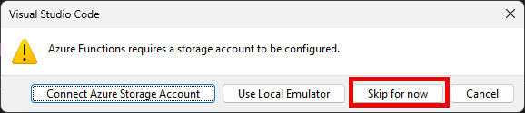

---
lab:
  topic: Azure Functions
  title: 使用 Visual Studio Code 建立 Azure Function
  description: 了解如何使用 HTTP 觸發程序建立 Azure Function。 在 Visual Studio Code 中本機建立及測試程式碼後，您可以將函式部署至 Azure。
---

# 使用 Visual Studio Code 建立 Azure Function

在本次練習中，您將了解如何建立回應 HTTP 要求的 C\# 函式。 在 Visual Studio Code 中本機建立及測試程式碼後，您可以在 Azure 中部署及測試函式。

在此練習中執行的工作：

* 建立本機專案
* 在本機執行函式
* 在 Azure 中部署及執行函式
* 清除資源

本練習大約需要 **15** 分鐘才能完成。

## 在您開始使用 Intune 之前

若要完成此練習，您需要：

* Azure 訂用帳戶。 如果您沒有免費試用版，則可以[免費註冊](https://azure.microsoft.com/)。

* 其中一個[支援平台](https://code.visualstudio.com/docs/supporting/requirements#_platforms)上的 [Visual Studio Code](https://code.visualstudio.com/)。

* [.NET 8](https://dotnet.microsoft.com/en-us/download/dotnet/8.0) 是目標架構。

* 適用於 Visual Studio Code 的 [C# 開發套件](https://marketplace.visualstudio.com/items?itemName=ms-dotnettools.csdevkit)。

* 適用於 Visual Studio Code 的 [Azure Functions 擴充功能](https://marketplace.visualstudio.com/items?itemName=ms-azuretools.vscode-azurefunctions)。

* Azure Functions Core Tools 4.x 版。 在終端機中執行下列命令，以在您的系統上安裝 Azure Functions Core Tools。 如需其他平台上的安裝指示，請瀏覽 [GitHub 上的 Azure Function Core Tools](https://github.com/Azure/azure-functions-core-tools?tab=readme-ov-file#installing)。

    ```
    winget uninstall Microsoft.Azure.FunctionsCoreTools
    winget install Microsoft.Azure.FunctionsCoreTools
    ```

    若您在安裝 Azure Function Core Tools 時遇到任何錯誤，請根據錯誤碼搜尋解決方案。 然後在上一個步驟中重試 **winget install** 命令。

## 建立本機專案

在本區段中，您會使用 Visual Studio Code，以 C# 建立本機 Azure Functions 專案。 稍後在本次練習中會將函式程式碼發佈至 Azure。

1. 在 Visual Studio Code 中，按 F1 開啟命令選擇區、搜尋和執行命令 **Azure Functions:** 建立新專案]。

1. 選取專案工作區的目錄位置，並選擇 **[選取]**。 您應建立新資料夾，或為專案工作區選擇空白資料夾。 請勿選擇已屬於工作區一部分的專案資料夾。

1. 依照提示提供下列資訊：

    | 提示 | 動作 |
    |--|--|
    | 選取將包含函式專案的資料夾 | 選取 [瀏覽...]**** 以選取應用程式的資料夾。
    | 選取語言 | 選取 [C#]****。 |
    | 選取 .NET 執行階段 | 選取 [.NET 8.0 隔離式方案]**** |
    | 為專案的第一個函式選取範本 | 選取 [HTTP 觸發程序]****。<sup>1</sup> |
    | 提供函式名稱 | 輸入 `HttpExample`。 |
    | 提供命名空間 | 輸入 `My.Function`。 |
    | 授權等級 | 選取 [匿名]****，可讓任何人呼叫您的函式端點。 |

    <sup>1</sup> 根據您的 VS Code 設定，您可能需要使用 [變更範本篩選條件]**** 選項來查看範本的完整清單。

1. 提示 [選取您要開啟專案的方式]** 時，請選取 [在目前的視窗中開啟]****。

1. Visual Studio Code 會使用提供的資訊，產生具有 HTTP 觸發程序的 Azure Functions 專案。 您可以在 Explorer 中檢視本機專案檔。

    > **注意**：若 VS Code 顯示標題為**您信任此資料夾中檔案的作者嗎？** 的快顯視窗，請選取 [是，我信任作者]**** 按鈕。

### 在本機執行函式

將 Visual Studio Code 與 Azure Functions Core Tools 整合可讓您在發佈至 Azure 之前，先在本機開發電腦上執行此專案。

1. 請確定終端機已在 Visual Studio Code 中開啟。 您可以依序選取 [終端機]**** 與功能表列中的 [新增終端機]**** 來開啟終端機。 

1. 按 **F5** 以啟動偵錯工具中的函數應用程式專案。 如果系統提示您選擇儲存體帳戶，請選取 [暫時跳過]****。

    

1. Core Tools 的輸出會顯示在 [終端機]**** 面板中。 您可以查看在本機執行的 HTTP 觸發函式的 URL 端點。

    ![螢幕擷取畫面顯示於 [終端機] 窗格中 HTTP 觸發函式的端點。](./media/01/run-function-local.png)

1. 執行 Core Tools 後，開啟 [Azure]**** 擴充功能。 在延伸模組的 [工作區]**** 區段中，展開 [本機專案]**** > [函式]****。 以滑鼠右鍵按一下 **HttpExample** 函式，然後選取 [立即執行函式...]****。

    ![顯示 [立即執行函式] 步驟位置的螢幕擷取畫面。](./media/01/execute-function-local.png)

1. 在 [輸入要求本文]**** 中，您會看到 `{ "name": "Azure" }` 的要求訊息本文值。 請按 **Enter** 鍵，將此要求訊息傳送至您的函式。 當函式在本機執行並傳回回應時，會在 Visual Studio Code 中引發通知。

    選取通知鈴鐺圖示以檢視通知。 函式的執行資訊會顯示於 [終端機]**** 面板中。

1. 按下 **Shift + F5** 即可停止 Core Tools，並中斷偵錯工具的連線。

確認函式可在本機電腦上正常執行之後，即可使用 Visual Studio Code 將專案直接發佈至 Azure。

## 在 Azure 中部署及執行函式

在本節中，您將建立 Azure Function 應用程式資源，並將函式部署至資源。

### 登入 Azure

在發佈應用程式之前，您必須先登入 Azure。 若您已登入，請移至下一區段。

1. 如果您尚未登入，請在 [活動] 列中選擇 [Azure] 圖示，然後在 **[Azure:資源]** 區域，選擇 [登入 Azure...]****。

    ![[登入 Azure] 按鈕的螢幕擷取畫面。](./media/01/functions-sign-into-azure.png)

1. 當在瀏覽器中收到提示時，請使用您的 Azure 帳戶認證選擇 Azure 帳戶並登入。

1. 成功登入之後，即可關閉新的瀏覽器視窗。 屬於您 Azure 帳戶的訂閱會顯示於提要欄位中。

### 在 Azure 中建立資源

在本區段中，您會建立部署本機函數應用程式所需的 Azure 資源。

1. 選擇 [活動] 列中的 Azure 圖示，然後在 [資源]**** 區域中選取 [建立資源...]****。

    ![[建立資源] 按鈕的螢幕擷取畫面。](./media/01/create-resource.png)    

1. 依照提示提供下列資訊：

    | 提示 | 動作 |
    |--|--|
    | 選取要建立的資源 | 選取 [Create Function App in Azure...] (在 Azure 中建立函數應用程式...)**** |
    | 選取訂閱 | 選取要使用的訂用帳戶。 「若您只有一個訂閱，就不會看見此選項。」** |
    | 輸入函數應用程式的全域唯一名稱 | 輸入在 URL 路徑中有效的名稱，例如 `myfunctionapp`。 您輸入的名稱會經過驗證，以確定其是唯一名稱。 |
    | 選取新資源的位置 | 如需更好的效能，請選取您附近的 [區域]。 |
    | 選取執行階段堆疊 | 選取 [.NET 8.0 隔離式方案]****。 |
    | 選取 [資源驗證類型] | 選取 [秘密]**** |

    此延伸模組會顯示在終端機視窗的 **Azure** 區域中所建立個別資源的狀態。
    
1. 完成時，下列 Azure 資源會使用根據您函數應用程式名稱的名稱，建立於您的訂閱中：

    * 資源群組，這是相關資源的邏輯容器。
    * 標準 Azure 儲存體帳戶，其可維護專案的狀態和其他資訊。
    * 彈性使用量方案定義了無伺服器函式應用程式的基礎主機。
    * 函式應用程式，可提供用來執行函式程式碼的環境。 函數應用程式可讓您將函式以邏輯單位分組，方便您在相同的主控方案中管理、部署及共用資源。
    * 連線至函式應用程式的 Application Insights 執行個體，可追蹤無伺服器函式的使用量。

### 將專案部署至 Azure

> **！重要事項：** 發佈至現有函式會覆寫任何先前的部署。

1. 在命令選擇區中，搜尋和執行命令 **Azure Functions:Azure Functions: Deploy to Function App...**。

1. 選取您在建立資源時所使用的訂閱。

1. 選取您建立的函式應用程式。 當系統提示您覆寫先前的部署時，請選取 [部署]****，將函式程式碼部署至新的函數應用程式資源。

1. 部署完成後，選取 [檢視輸出]**** 以檢視部署結果的詳細資料。 如果您錯過通知，請選取右下角的通知鈴鐺圖示以再次查看。

    ![[檢視輸出] 按鈕的螢幕擷取畫面。](./media/01/function-view-output.png)

### 在 Azure 中執行函數

1. 返回提要欄位中的 [資源]**** 區域，依序展開您的訂閱和新函數應用程式，以及 [函式]****。 **以滑鼠右鍵按一下** **HttpExample** 函式，然後選擇 [立即執行函式...]****。

    ![[立即執行函式] 選項的螢幕擷取畫面。](./media/01/execute-function-remote.png)

1. 在 [輸入要求本文]**** 中，您會看到 `{ "name": "Azure" }` 的要求訊息本文值。 請按 **Enter** 鍵，將此要求訊息傳送至您的函式。

1. 當函式在 Azure 執行並傳回回應時，會在 Visual Studio Code 中引發通知。 選取通知鈴鐺圖示以檢視通知。

## 清除資源

現在您已完成練習，您應該刪除建立的雲端資源，以避免不必要的資源使用狀況。

1. 在網頁瀏覽器中，瀏覽至 Azure 入口網站 [https://portal.azure.com](https://portal.azure.com)；若出現提示，請使用您的 Azure 認證登入。
1. 瀏覽至您建立的資源群組，並檢視此練習中所使用的資源內容。
1. 在工具列上，選取 [刪除資源群組]****。
1. 輸入資源群組名稱並確認您想要將其刪除。

> **注意：** 刪除資源群組時，會刪除其中包含的所有資源。 如果您選擇此練習的現有資源群組，則本練習範圍外的任何現有資源也將遭到刪除。
